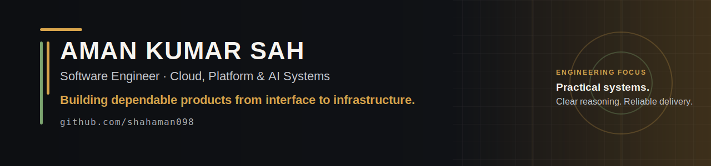

<!--
  Aman Kumar Sah
  GitHub: https://github.com/shahaman098
  Portfolio: https://amankumarsah.com.np
  LinkedIn: https://www.linkedin.com/in/amansahcode/
-->

  

  <a href="https://amankumarsah.com.np">Portfolio</a>
  &nbsp;&bull;&nbsp;
  <a href="https://www.linkedin.com/in/amansahcode/">LinkedIn</a>
  &nbsp;&bull;&nbsp;
  <a href="mailto:amanshah0844@gmail.com">Email</a>

## Building useful systems, end to end

I am Aman, a final-year software engineer focused on cloud, platform, and backend work. I build practical products that combine reliable engineering with thoughtful AI workflows: from infrastructure validation and developer tooling to health and agentic-product prototypes.

I am currently open to graduate, junior, and internship opportunities where I can help ship dependable software and keep growing alongside a strong engineering team.

## Selected work

| Project | What I built | Technology |
| :--- | :--- | :--- |
| [MigrationOps Copilot](https://github.com/shahaman098/MigrationOps-Copilot) | An AI-assisted migration validation workflow that compares DNS, SSL, and HTTP health, produces a reviewable remediation plan, and requires human approval before simulated execution. | Python, FastAPI, Azure OpenAI, Microsoft Agent Framework |
| [Defib](https://github.com/shahaman098/Defib) | An autonomous DAO quorum-rescue agent that monitors proposals, evaluates risk, coordinates voting incentives, and records auditable on-chain reasoning. | TypeScript, Solidity, Hardhat, Ethers.js |
| [TriageZero](https://github.com/shahaman098/TriageZero) | An interactive AI-orchestration control room showing messy requests routed through agents, human oversight, and a finished launch artifact. | React, TypeScript, Vite |
| [OrchestrAI](https://github.com/shahaman098/OrchestrAI) | A multi-retailer shopping agent that interprets a request, ranks products by price and delivery, builds a unified cart, and simulates checkout. | Node.js, Express, React, OpenAI API |

  <a href="https://github.com/shahaman098?tab=repositories">Explore all repositories</a>
  &nbsp;&bull;&nbsp;
  <a href="https://myhealth-navigator.vercel.app">View MyHealth Navigator</a>

## How I work

- Start with the real user or operational problem, then make the technical trade-offs explicit.
- Use deterministic checks and human approval around AI-driven workflows where reliability matters.
- Own the full path from product interface to API, automation, deployment, and documentation.
- Prefer clear, maintainable systems over demo-only complexity.

## Core toolkit

`TypeScript` &middot; `Python` &middot; `React` &middot; `Next.js` &middot; `Node.js` &middot; `FastAPI` &middot; `SQL` &middot; `Docker` &middot; `AWS` &middot; `GitHub Actions` &middot; `OpenAI API`

## GitHub activity

  

<picture>
  
</picture>

## Let's talk

If you are hiring for a software, platform, backend, or applied-AI role, I would be glad to connect: [amanshah0844@gmail.com](mailto:amanshah0844@gmail.com).
